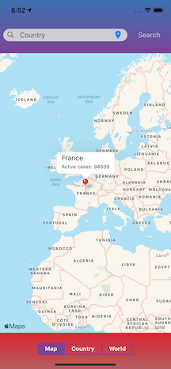
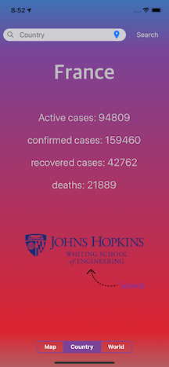
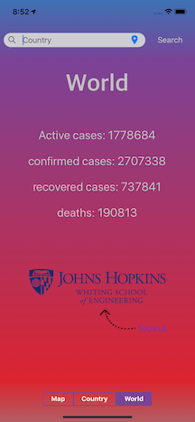
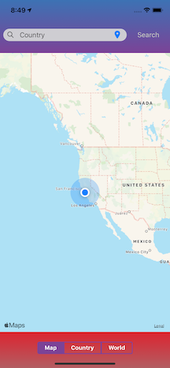

# Covid-19 Global Tracker App (IOS and Android)

## General

This app tracks the global spread of the covid-19 virus. Users can get the following data for a country:

- Number of total cases
- Number of active cases
- Number of recovered cases
- Number of deaths

## How to Use

### How to get the data for a country

There are two ways of getting the data for a country.

1. The first is to drop a pin anywhere in the country on the map and press on the pin. The pin will then display the number of active cases. If you want to view the number of recovered cases, total cases, or deaths, simply press on the "country" toggle at the bottom of the screen or press on the description above the placed marker. If you drop a pin on an invalid country, the search bar will display "country not found"

2. The second way is to simply search for the country on the search bar. If a country is not found, the search bar will display "country not found".

### How to get data for the world

To get data for the world, simply press on the "world" toggle at the bottom of the screen.

### How to get data for current location

The app's country section defaults to your current location, but if you pulled the data for another country and would like to go back to your current country, simply press on the location pin to the right of the search bar.

## Tip

- You can add multiple pins on the map. This allows you to quickly compare the cases for multiple countries at once.

## Data

The covid-19 data that is used for this appliaction comes from Johns Hopkins University. Data on the app is refreshed every time you drop a new pin or switch to the "world" tab.

## How to run locally

This app requires a google cloud api. Therefore, before running the app you must add you api key in the following locations:

1. In 'covidApp/ios/AppDelegate.m' line 31
2. In 'covidApp/pages/Landing.js' line 121

To run the application locally in a simulator, do the following:

1. Run "npm install"
2. Run "npx react-native start" to start a development server
3. In a seperate terminal, run "npx react-native run-ios" to run in an Iphone simulator (requires Xcode) or "npx react-native run-android" requires android studio
